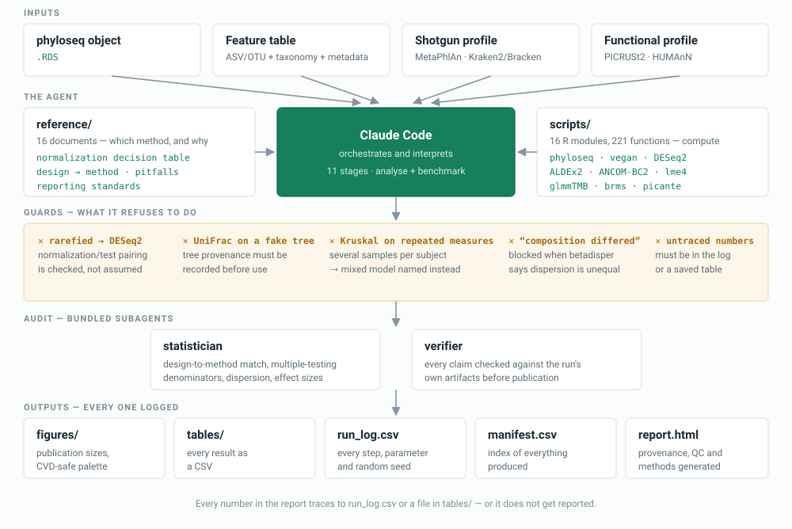
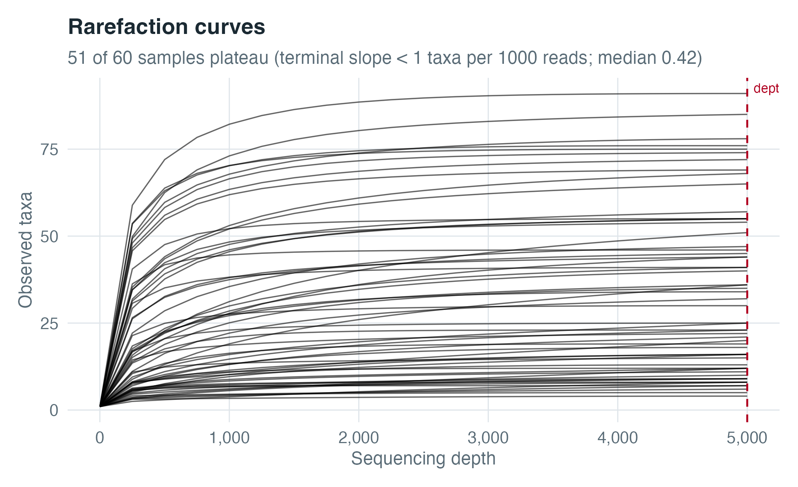
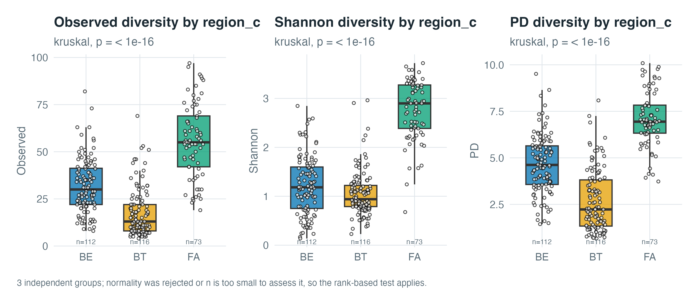
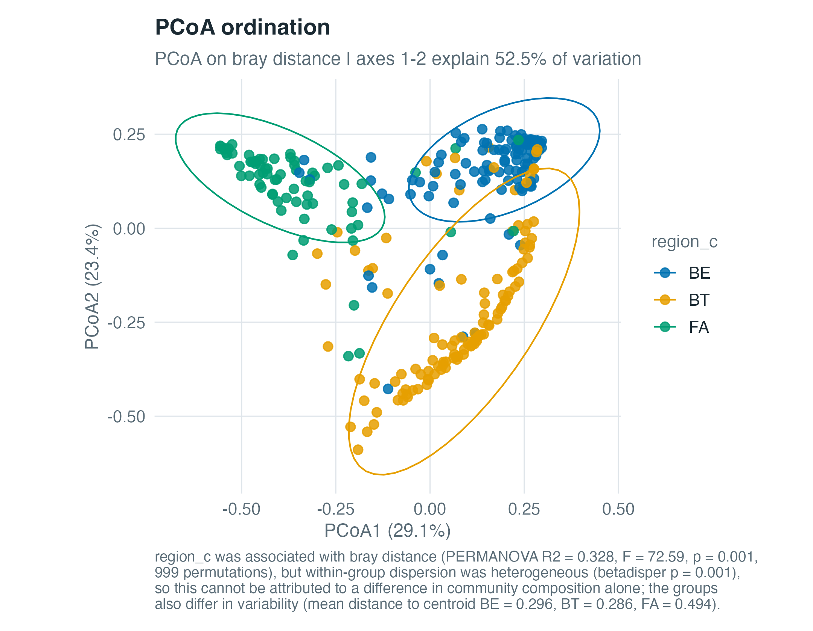
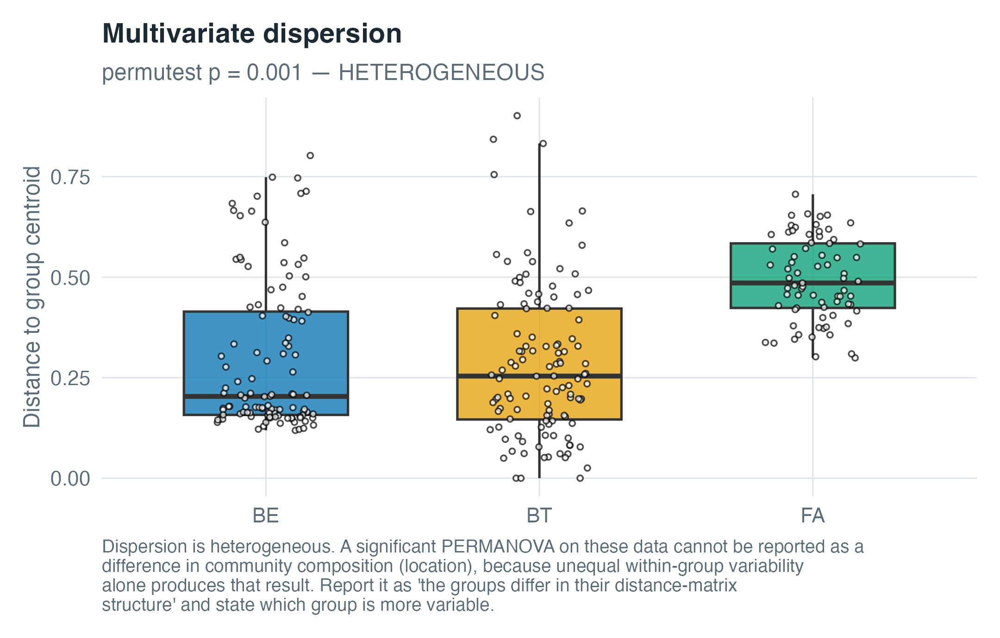
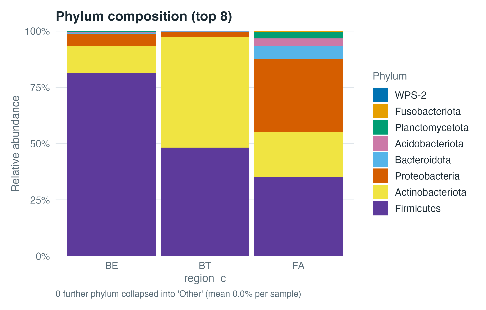
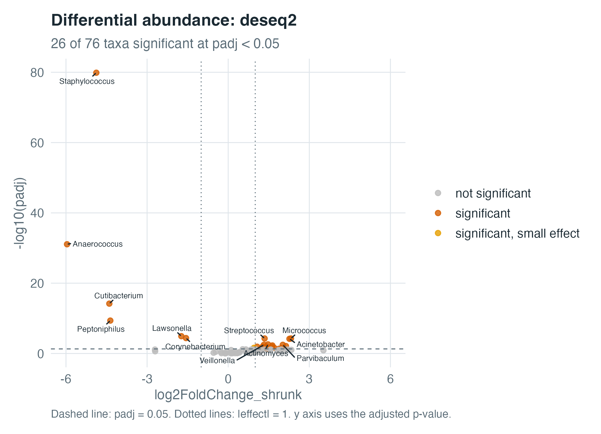
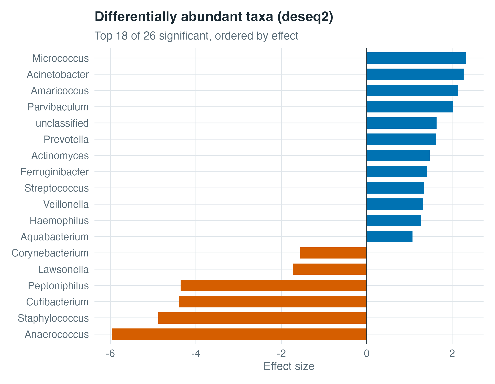
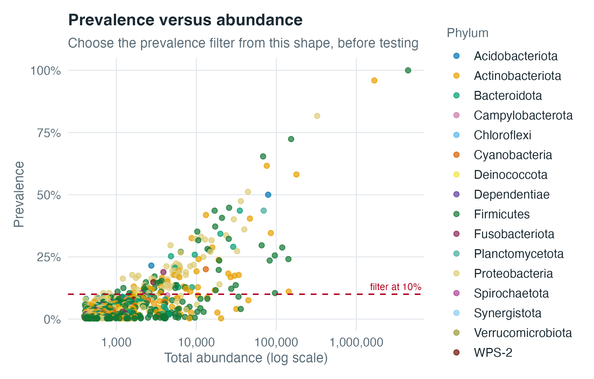

<p align="center">
  
</p>

<p align="center">
  <strong>A downstream microbiome analysis agent for Claude Code.</strong><br>
  16S amplicon and shotgun metagenomics, from a feature table to plots, statistics and a reproducible report.
</p>

<p align="center">
  <a href="https://doi.org/10.5281/zenodo.22731452"></a>
  <a href="LICENSE"></a>
  
  
</p>

<p align="center">
  <a href="#install">Install</a> ·
  <a href="#using-it">Use</a> ·
  <a href="#what-it-produces">Outputs</a> ·
  <a href="#what-makes-it-different">Guards</a> ·
  <a href="#validation">Validation</a>
</p>

---

## Why it exists

Microbiome analysis has a specific failure mode: the pipeline runs cleanly, the
figures look publishable, and the answer is wrong. Rarefied counts get fed to
DESeq2. UniFrac is computed on a placeholder tree. Five samples from the same
participant are treated as five independent draws. A significant PERMANOVA is
reported as a shift in community composition when the groups differ only in how
variable they are.

None of those error. All of them produce output you would put in a paper.

MicroFitGut encodes the decisions that prevent them, and **refuses** the
combinations that cause them. It was built against two Springer textbooks, a
graduate course's demonstrations and problem sets, and a working Shiny dashboard
— then validated by re-running that course's stated answers and explaining every
difference.

---

## How it is built

<p align="center">
  
</p>

The model orchestrates and interprets. The R functions compute. That split is the
whole design:

- **`reference/`** — 16 documents, ~17,900 words. The judgement: a decision table
  mapping normalization to the analyses it is valid for, design-to-method tables
  for differential abundance and regression, reporting standards, and a pitfalls
  file covering compositionality, the rarefaction dispute, pseudo-replication,
  structural zeros and taxonomic name instability.
- **`scripts/`** — 16 R modules, ~7,900 lines, 221 functions. The computation,
  with every guard built in and every step logged.
- **`agents/`** — two auditing subagents that run before a report is final.

Nothing is improvised. If a function exists for a step, the agent calls it —
because an unlogged computation cannot be traced, and an untraceable number does
not get reported.

---

## Install

### 1. What you need first

| | |
|---|---|
| **Claude Code** | The CLI, desktop app (macOS/Windows), or the VS Code / JetBrains extension. Install it from [code.claude.com/docs](https://code.claude.com/docs). |
| **R 4.4 or later** | MicroFitGut runs R for every computation. Get it from [r-project.org](https://www.r-project.org/), or `brew install r` on macOS. Check with `R --version`. |

### 2. Open a Claude Code session

Open a terminal — **Terminal** or **iTerm** on macOS, **Windows Terminal** or
**PowerShell** on Windows, any shell on Linux — then move to the folder holding
the data you want to analyse and start Claude Code:

```bash
cd ~/Documents/my-study      # wherever your data lives
claude
```

Claude Code takes over the terminal and gives you its own prompt:

```
╭──────────────────────────────────────────────╮
│ ✻ Welcome to Claude Code                     │
╰──────────────────────────────────────────────╯

>
```

**That `>` is the Claude Code prompt, and it is where the next commands go.** If
you are using the desktop app or an IDE extension, the same prompt appears in
Claude Code's own panel — you do not need a separate terminal.

> **The commands below are slash commands, not shell commands.** They only work
> at the `>` prompt. Typing them into bash or zsh will fail.

### 3. Install the plugin

At the `>` prompt, type each line and press Enter:

```
/plugin marketplace add barah123/MicroFitGut
```

This registers this repository as a plugin marketplace. You should see it
confirm that the marketplace `microfitgut` was added.

```
/plugin install microfitgut@microfitgut
```

This installs the plugin itself. The `@microfitgut` suffix names the marketplace
it comes from — useful once you have several configured.

**Then restart Claude Code.** Plugins load at startup, so exit with `/exit` (or
Ctrl-D) and run `claude` again. The skill will not appear until you do.

<details>
<summary>Prefer your shell? Same thing, without opening a session</summary>

```bash
claude plugin marketplace add barah123/MicroFitGut
claude plugin install microfitgut@microfitgut
```

Plugins install to `~/.claude/plugins/`, so **the directory you run this from
does not matter** — once installed, MicroFitGut is available in every project on
your machine.
</details>

### 4. Check it worked

Back at the `>` prompt:

```
/microfitgut:microfitgut
```

It should load and describe the eleven stages. Or skip the slash command
entirely and just describe what you want:

> analyse the 16S data in `ps9.RDS` — does diversity differ by region?

<details>
<summary>Removing it again</summary>

```
/plugin uninstall microfitgut
/plugin marketplace remove microfitgut
```

Note the marketplace is removed by the name in its manifest (`microfitgut`), not
by the repository name.
</details>

### Requirements

R 4.4+ and 37 CRAN/Bioconductor packages. MicroFitGut checks them at startup and
tells you exactly what is missing:

```
MicroFitGut package check: 34 of 37 requirements satisfied

Unavailable — these analyses are blocked until installed:
  [alpha] picante   -> install.packages("picante")
  [da]    ANCOMBC   -> BiocManager::install("ANCOMBC")
```

It never substitutes a different method for a missing one. A missing package is a
blocked analysis, not a reason to quietly pick something else.

<details>
<summary>Install everything up front</summary>

```r
install.packages(c("vegan","ape","picante","ggpubr","FSA","DescTools","multcomp",
                   "lme4","lmerTest","glmmTMB","car","pscl","lmtest","brms","loo",
                   "metacoder","igraph","cluster","phangorn","pheatmap","patchwork",
                   "viridis","ggrepel","scales","knitr","rmarkdown","dplyr","ggplot2"))

if (!requireNamespace("BiocManager", quietly = TRUE)) install.packages("BiocManager")
BiocManager::install(c("phyloseq","microbiome","DESeq2","ALDEx2","ANCOMBC",
                       "ggtree","Biostrings"))
```
</details>

---

## Using it

Start Claude Code in the folder holding your data and describe the question. A
useful request names the file, the grouping variable, and anything about the
design that matters:

> analyse `data/study.RDS` — does community structure differ by treatment?
> Samples are repeated within participant, so account for that.

MicroFitGut validates the input first and tells you what it found before running
anything, so the design detail above is a courtesy rather than a requirement —
it detects repeated measures on its own and will refuse the tests that assume
independence either way.

It then states its plan — the tests it will run, the thresholds it will use, and
why — before touching the data. Filters and the primary differential-abundance
method are fixed at that point, because choosing them after seeing p-values
invalidates the false-discovery rate.

### Accepted inputs

| Input | Format |
|---|---|
| phyloseq object | `.RDS` |
| ASV/OTU + taxonomy + metadata | `.csv` / `.tsv` / `.txt` |
| Shotgun taxonomic profile | MetaPhlAn, Kraken2/Bracken |
| Functional profile | PICRUSt2, HUMAnN |
| BIOM table | `.biom` |

### Two modes

**analyse** — eleven stages: intake and validation → plan → QC → normalization →
alpha diversity → beta diversity → differential abundance → models → composition
→ figures → report.

**benchmark** — reanalyse a dataset whose published result is known, measure
concordance with the paper, and attribute any divergence to a specific analytical
decision. A study card records what the paper stated and, more importantly, what
it did not; unstated parameters become axes in a sensitivity sweep; the dominant
axis is computed, not asserted; and "no tested factor accounts for this" is a
valid answer the tool will give.

### Other surfaces

| Context | How |
|---|---|
| Claude Code, interactive | `/microfitgut:microfitgut` |
| Scripted / non-interactive | `claude -p "analyse the 16S data in data/ by treatment"` |
| Programmatic | Claude Agent SDK — it keeps the Bash tool, so R works |

Managed Agents will not work: the hosted sandbox has no R or Bioconductor.

---

## What it produces

Every figure below is real output from the bundled skin-microbiome study
(619 taxa × 344 samples, 128 participants, depth 1,107–137,913). Nothing here is
a mock-up.

### It tells you what the data is before analysing it

```
=== MicroFitGut input validation ===
619 taxa x 344 samples   ranks: Kingdom, Phylum, Class, Order, Family, Genus, Species
Values: read counts, all integer
Depth: min 1107 | median 26506 | max 137913  (124.6-fold range)
Sparsity: 91.8% zeros | 0 taxa all-zero
Group 'region_c': BE=121, BT=122, FA=101
Repeated measures: 'patient' (128 levels, up to 5 each)

WARNINGS (must be stated in the report):
  - Depth varies 125-fold across samples. Normalization is not optional here.
  - 91.8% of the table is zeros. Consider zero-inflated models.
  - A tree is present but its provenance is unrecorded. UniFrac and Faith's PD
    on a placeholder tree return numbers that look valid and encode nothing.
  - Repeated measures detected: 'patient' has up to 5 samples per level across
    128 levels. Independent-samples tests treat these as independent draws and
    overstate significance.
```

### Rarefaction, with the plateau judged rather than eyeballed



Plateau is decided by the **terminal slope in taxa per 1,000 reads** — how many
new taxa another 1,000 reads would reveal — not by the slope relative to the start
of the curve, which declares a plateau almost regardless of saturation.

### Alpha diversity, with the test that was actually run



n per group on the plot, individual points over the boxes, the test named in the
subtitle, and the reason for choosing it once beneath. Benjamini-Hochberg is
applied across indices, because six indices against one variable is six tests.

### Ordination — and the qualification most analyses drop



PERMANOVA gives R² = 0.328, p = 0.001 with permutations stratified within
participant. **But betadisper gives p = 0.001**, so this is *not* reportable as a
shift in community composition — the groups also differ in how variable they are
(mean distance to centroid 0.296, 0.286, 0.494). You can see it in the figure: the
green group is visibly more spread than the other two.

`permanova_sentence()` writes the qualified conclusion. It will not write the
unqualified one.



### Composition and differential abundance





The y axis is the **adjusted** p-value, so the visual threshold is the one the
claim rests on, and the subtitle reports the tested denominator — not the number
of rows in the table.



### Choosing a filter visibly, before testing



On this study a 10% prevalence filter removes 459 of 602 taxa and **retains 89.3%
of the reads** — almost all of the multiple-testing burden and almost none of the
data. The threshold is fixed before any test runs; choosing it after seeing
p-values invalidates the FDR.

---

## What makes it different

It refuses. Each guard catches an error that otherwise produces a clean,
publishable-looking, wrong result.

| Guard | What it stops |
|---|---|
| **Normalization pairing** | Rarefied counts reaching DESeq2, TSS reaching Chao1, CLR reaching ANCOM-BC2. The valid states are tabulated per analysis and checked, not assumed. |
| **Tree provenance** | A random tree merged in to satisfy phyloseq's slot gives UniFrac and Faith's PD values that look entirely valid and encode nothing. Phylogenetic metrics stay blocked until the tree is confirmed real. |
| **Repeated measures** | Several samples per subject are detected, and independent-samples tests are refused with the correct mixed model named instead. |
| **Dispersion** | Every PERMANOVA carries a betadisper check, and the conclusion sentence will not say "composition differed" when dispersion does not license it. |
| **Traceability** | Every number in the report must trace to `run_log.csv` or a saved table. A mechanical check flags the rest for the `verifier` subagent. |

A guard that refuses is doing its job. The message says which reference file
explains the decision and what the valid alternatives are.

### Two auditing subagents, bundled

- **`microfitgut:statistician`** — design-to-method match, the shifting
  multiple-testing denominator, REML-vs-ML for model comparison, singular fits,
  Bayesian convergence gates, and post-hoc gating.
- **`microfitgut:verifier`** — every claim checked against the run's own
  artifacts: `run_log.csv`, `manifest.csv`, `tables/`, `figures/`.

Both know the log format and where to look.

---

## Validation

MicroFitGut was re-run against every numeric answer stated in a graduate
microbiome course's problem sets and quizzes.

**106 checks: 90 match, 8 differ, 1 blocked by a guard, 2 have no input data** —
92% agreement, and every difference attributed to a specific, reproducible cause.

Exact agreement, to every digit the course printed: all 45 mixed-model checks
(F statistics, chi-squares, p-values, AIC, likelihood-ratio tests), the
zero-inflated model comparison (ZINB 2257.44, ZHNB 2257.33, log-likelihoods
−63688.7 and −1123.72), the alpha-diversity statistics, and the Bayesian joint
model's conclusions.

The eight differences resolved to two real problems in the source material:

1. **A degenerate size-factor estimator.** One dataset has exactly 1 of 51 taxa
   present in every sample, so DESeq2's default derived all 209 size factors from
   that single taxon. MicroFitGut uses the positive-count geometric mean over all
   taxa; the two size-factor vectors correlate at **−0.10**.
2. **A variable-shadowing bug** that fed already-normalized counts to DESeq2.

Replicating both choices reproduced the course's numbers exactly — which is what
turns a discrepancy into an attribution.

The exercise also found and fixed **six bugs in MicroFitGut itself**, including a
structurally biased rarefaction-plateau criterion, a likelihood-ratio test that
silently returned NULL, and log events that never reached disk.


### Benchmark against published studies

Beyond the course regression, MicroFitGut is benchmarked against a **set of ten
published studies — five 16S amplicon, five shotgun metagenomic** — chosen to
exercise every input format and design feature the tool claims to handle. This is
a purposive coverage matrix, not a sample: it tests the software, so the results
must not be read as a rate at which the literature reproduces.

Full reports are in [`validation/`](validation/); the manifest is
[`validation/validation-set-manifest.csv`](validation/validation-set-manifest.csv)
(and `.xlsx`).

**Neither the papers nor the datasets are redistributed here.** Every study is
identified by its DOI or accession so it can be retrieved from source, which keeps
provenance intact and avoids republishing material under licences that do not
permit it. Each report carries the code needed to reproduce it.

| # | ID | Tech | Study | Journal, year | Paper DOI | Data repository | Accession | Verdict |
|---|---|---|---|---|---|---|---|---|
| 0 | **A0** | 16S | Testing the "Grandma Hypothesis": Characteriz… | Journal of Microbiology & Bi, 2020 | [10.1128/jmbe.v21i1.2010](https://doi.org/10.1128/jmbe.v21i1.2010) | NCBI SRA | [`PRJNA553551`](https://www.ncbi.nlm.nih.gov/bioproject/PRJNA553551) | Partially reproduced |
| 1 | **S1** | Shotgun | Colorectal Cancer and the Human Gut Microbiom… | PloS one, 2016 | [10.1371/journal.pone.0155362](https://doi.org/10.1371/journal.pone.0155362) | curatedMetagenomicData | [`VogtmannE_2016`](https://doi.org/10.18129/B9.bioc.curatedMetagenomicData) | Reproduced |
| 2 | **S4** | Shotgun | Altered Gut Microbiome Profile in Patients Wi… | Hypertension, 2020 | [10.1161/hypertensionaha.119.14294](https://doi.org/10.1161/hypertensionaha.119.14294) | Dryad | [`10.5061/dryad.stqjq2c03`](https://doi.org/10.5061/dryad.stqjq2c03) | _pending_ |
| 3 | **A3** | 16S | The microbiome of the ant‐built home: the mic… | Ecosphere, 2017 | [10.1002/ecs2.1639](https://doi.org/10.1002/ecs2.1639) | Dryad | [`10.5061/dryad.ph2c5`](https://doi.org/10.5061/dryad.ph2c5) | _pending_ |
| 4 | **A1** | 16S | Unique bacterial assembly, composition, and i… | Journal of Experimental Bota, 2020 | [10.1093/jxb/erz572](https://doi.org/10.1093/jxb/erz572) | Dryad | [`10.5061/dryad.7wm37pvnk`](https://doi.org/10.5061/dryad.7wm37pvnk) | _pending_ |
| 5 | **S3** | Shotgun | The dynamics of the human infant gut microbio… | Cell host & microbe, 2015 | [10.1016/j.chom.2015.01.001](https://doi.org/10.1016/j.chom.2015.01.001) | curatedMetagenomicData | [`KosticAD_2015`](https://doi.org/10.18129/B9.bioc.curatedMetagenomicData) | _pending_ |
| 6 | **S2** | Shotgun | Gut microbiome development along the colorect… | Nature communications, 2015 | [10.1038/ncomms7528](https://doi.org/10.1038/ncomms7528) | curatedMetagenomicData | [`FengQ_2015`](https://doi.org/10.18129/B9.bioc.curatedMetagenomicData) | _pending_ |
| 7 | **S5** | Shotgun | Integrated Metagenomic and Metabolomic Analys… | Metabolites, 2024 | [10.3390/metabo14120713](https://doi.org/10.3390/metabo14120713) | Zenodo | [`10.5281/zenodo.13917959`](https://doi.org/10.5281/zenodo.13917959) | _pending_ |
| 8 | **A2** | 16S | Comparative analysis of microbiota along the … | Ecology and Evolution, 2019 | [10.1002/ece3.5789](https://doi.org/10.1002/ece3.5789) | Dryad | [`10.5061/dryad.931zcrjfn`](https://doi.org/10.5061/dryad.931zcrjfn) | _pending_ |
| 9 | **A4** | 16S | Gut microbiota from multiple sclerosis patien… | Proceedings of the National , 2017 | [10.1073/pnas.1711233114](https://doi.org/10.1073/pnas.1711233114) | UCSF Dash | [`10.7272/Q6RX997G`](https://doi.org/10.7272/Q6RX997G) | _pending_ |

Two studies are complete. **A0 (Pérez-Losada)** returned *partially reproduced*:
the alpha-diversity finding survived a mixed model, but a significant PERMANOVA
was accompanied by heterogeneous dispersion (betadisper p = 0.001), so the
composition claim is not licensed by the test used. **S1 (Vogtmann)** returned
*reproduced* — all eight claims held, through a different taxonomic profiler.

That contrast is the point of the matrix: a clean study yields a clean verdict,
so the tool is not manufacturing disagreement.

Running these has so far exposed **ten defects in MicroFitGut**, every one biased
toward reporting non-reproduction — the direction that would have flattered the
tool. All are fixed, and all were fixed before any corpus study was scored.

---

## What ships

```
microfitgut/
├── skills/microfitgut/
│   ├── SKILL.md          the 11-stage workflow and benchmark mode
│   ├── reference/        16 documents — the analytical decisions
│   └── scripts/          16 R modules, 221 functions
├── agents/
│   ├── statistician.md
│   └── verifier.md
└── assets/               logo, architecture diagram, example figures
```

---

## Scope

Downstream only. Reads are already denoised and classified; MicroFitGut starts
from a feature table. No FASTQ processing, no DADA2, no QIIME 2 — and no workflow
manager, because a downstream analysis of a cleaned table runs in minutes on a
laptop and Snakemake or Nextflow would be pure overhead.

---

## Citing MicroFitGut

Every release is archived on Zenodo with its own DOI.

> Appiah, P. (2026). *MicroFitGut: a downstream microbiome analysis agent for
> Claude Code* (Version 1.1.0) [Computer software]. Zenodo.
> https://doi.org/10.5281/zenodo.22731452

**Cite the concept DOI — [`10.5281/zenodo.22731452`](https://doi.org/10.5281/zenodo.22731452) —** which always
resolves to the newest release. Use the version DOI
[`10.5281/zenodo.22731453`](https://doi.org/10.5281/zenodo.22731453) only when you need to pin the exact
version you ran.

<details>
<summary>BibTeX</summary>

```bibtex
@software{appiah_microfitgut_2026,
  author    = {Appiah, Philip},
  title     = {MicroFitGut: a downstream microbiome analysis agent for Claude Code},
  year      = {2026},
  version   = {1.1.0},
  publisher = {Zenodo},
  doi       = {10.5281/zenodo.22731452},
  url       = {https://doi.org/10.5281/zenodo.22731452}
}
```
</details>

`CITATION.cff` drives GitHub's **Cite this repository** button; `.zenodo.json`
supplies the metadata Zenodo archives.

---

## Credits

Built by **Philip Appiah**
([0009-0002-0706-2506](https://orcid.org/0009-0002-0706-2506)),
The George Washington University.

Grounded in Xia & Sun, *Bioinformatic and Statistical Analysis of Microbiome Data*
(Springer, 2023); Xia, Sun & Chen, *Statistical Analysis of Microbiome Data with R*
(Springer, 2018); and course material by Marcos Pérez-Losada. Visual conventions
carry over from CanisLupus 2.0. Categorical palettes follow Okabe-Ito, continuous
scales viridis — both colour-vision-safe, because in an ordination colour *is* the
encoding.

Released under the [MIT License](LICENSE). Use it, change it, build on it — the
only condition is that the copyright notice travels with it.

MicroFitGut analyses data. It does not replace the judgement of whoever signs the
paper.
